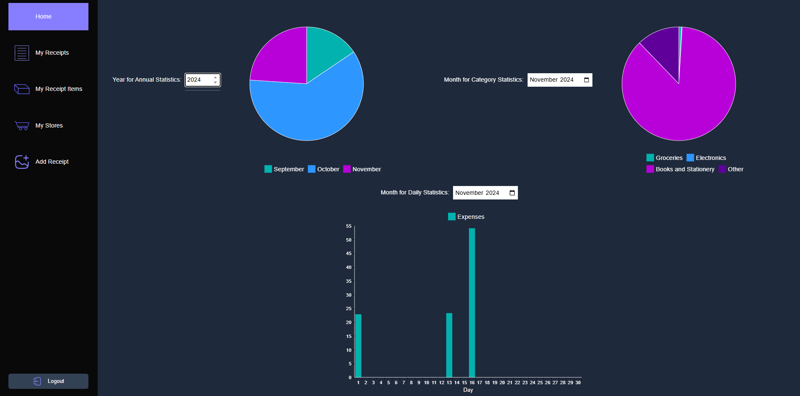
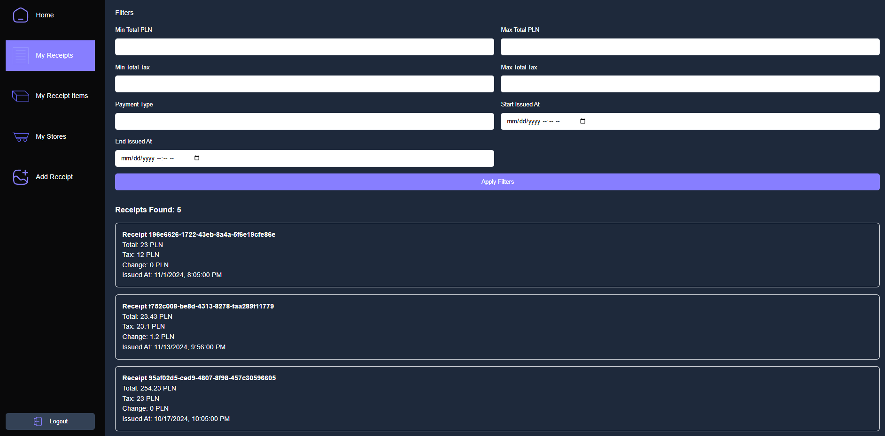

# Description
Back-end is structured using **Clean Architecture** follows the separation of concerns and ensures modularity. The architecture consists of the following layers: App, Application, Domain, Infrastructure and Presentation. Back-end uses PostGres database for storage, which is set-up in appsettings.json or appsettings.Development.json. 

To run the application, use the following command in the terminal:
```sh
dotnet run --project ReceiptApp/ReceiptApp.App/ReceiptApp.App.csproj
```

The front-end is a simple application built with React and styled using Tailwind CSS. To build this component, use the following command in the terminal:
```sh
cd Frontend
npm run build
```
Or, to run the front-end in development mode, use the following command:
```sh
cd Frontend
npm run dev
```

# Screenshots



